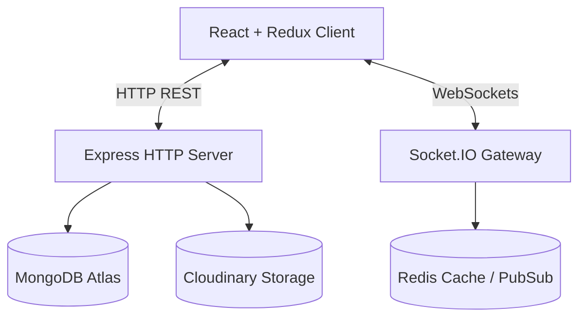

# ChatSphere Architecture Documentation

## Overview
ChatSphere is built as a highly scalable, real-time chat application using a modern TypeScript monorepo setup (`shared/`, `server/`, `client/`).

## Architecture Diagram

## Core Technology Stack
- **Frontend**: React 19, Redux Toolkit, React Router, Tailwind CSS v4, Socket.IO Client.
- **Backend**: Node.js, Express, Socket.IO, Mongoose (MongoDB), IoRedis, Zod validation.
- **Shared**: Monorepo workspace containing common TypeScript models, constants, and validation schemas.

## Redis Integration Strategy
- **Presence Tracking**: Ephemeral user online states managed via Redis `SADD`/`SREM` operations for instantaneous O(1) multi-server presence sync.
- **Socket Adapter**: `@socket.io/redis-adapter` enables seamless horizontal scaling across multiple Node.js server instances.
